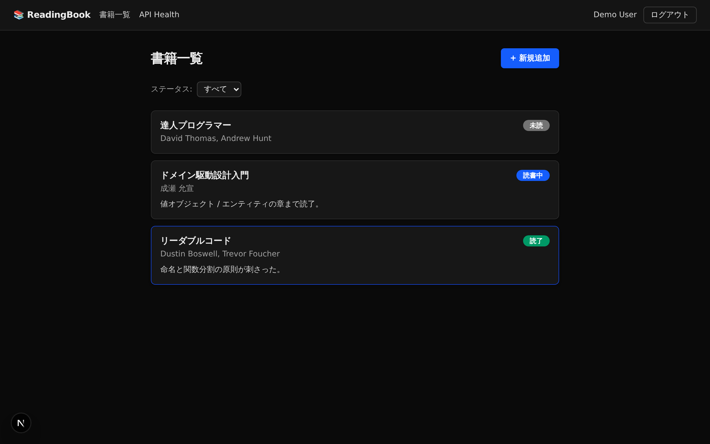
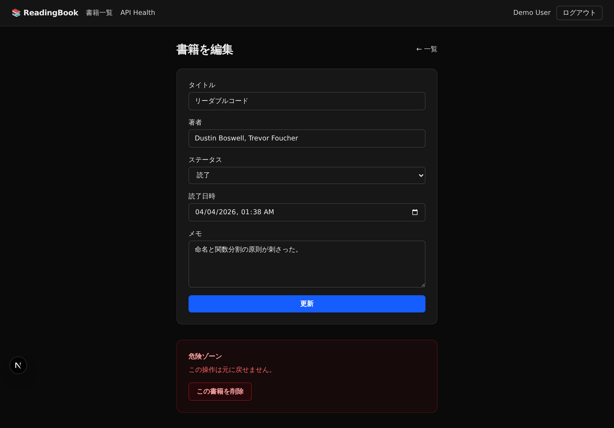
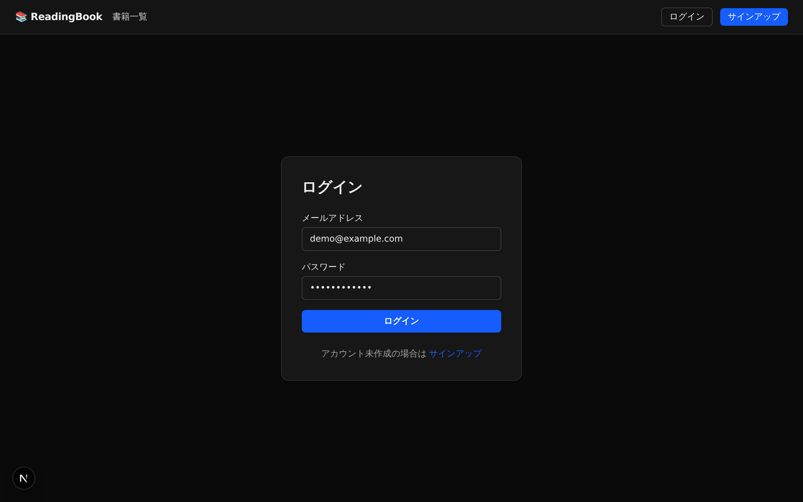
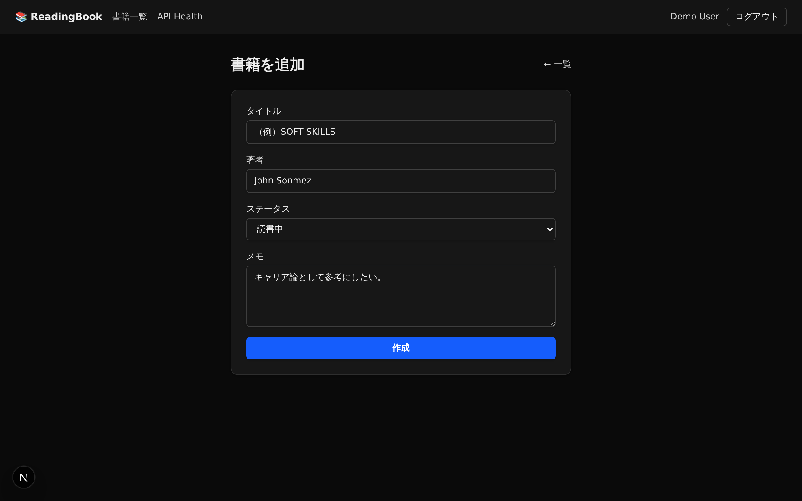

# readingbook-management

読書記録を管理するアプリ。

## 概要

読んだ本のタイトル・著者・感想・読了日などを記録し、自分の読書履歴を管理できるWebアプリケーションです。

## デモ

http://54.249.65.144

AWS EC2 上に [Terraform](infra/envs/emergency/) で構築した一時デプロイ環境です（VPC + 単一 EC2 上で docker compose により backend / frontend / MySQL を同居）。動作確認用なので、確認が済み次第 `terraform destroy` で停止します。

## スクリーンショット

| 書籍一覧 | 書籍を編集 |
| --- | --- |
|  |  |

| ログイン | 書籍を追加 |
| --- | --- |
|  |  |

## 技術スタック

- **バックエンド**: Ruby 3.3 / Ruby on Rails 8.1（API mode）/ JWT 認証
- **フロントエンド**: Next.js 16（App Router）/ React 19 / TypeScript / Tailwind CSS v4
- **データベース**: MySQL 8.4（開発: docker / 本番: AWS RDS）
- **インフラ**: AWS（RDS）
- **テスト**: RSpec / Vitest / Playwright
- **CI**: GitHub Actions（並行 3 ジョブ）

## 主な機能

- ユーザー認証（サインアップ / ログイン / ログアウト）
- 書籍の登録・編集・削除
- 読書ステータス管理（未読 / 読書中 / 読了）
- ステータス別の絞り込み
- 読了日時・著者・メモの記録

## セットアップ

開発環境はすべて Docker / Docker Compose で動作します。ホストに Ruby / Node / MySQL を入れる必要はありません。

### 必要環境

- Docker Desktop（Windowsの場合は WSL2 backend）

### 手順

```bash
# 1. 環境変数ファイルを用意
cp .env.example .env

# 2. コンテナをビルド・起動
docker compose up --build

# 3. 初回のみ DB を作成・マイグレーション（別ターミナルで）
docker compose exec backend bundle exec rails db:create db:migrate
```

起動すると以下にアクセスできます。

- Rails API: http://localhost:3000
- Next.js: http://localhost:3001
- MySQL: `localhost:3306`（ユーザ: `root` / パスワード: `.env` の `MYSQL_ROOT_PASSWORD`）

### よく使うコマンド

```bash
# 停止
docker compose down

# DBもまっさらに
docker compose down -v

# Railsコンソール
docker compose exec backend bundle exec rails console

# マイグレーション生成
docker compose exec backend bundle exec rails generate migration MigrationName

# ログ確認
docker compose logs -f backend
docker compose logs -f frontend
```

## ディレクトリ構成

```
readingbook-management/
├── backend/             # Ruby on Rails 8.1 (API mode)
│   ├── app/             # controllers / models / services
│   ├── spec/            # RSpec
│   └── Dockerfile.dev
├── frontend/            # Next.js 16 (App Router / TypeScript / Tailwind v4)
│   ├── src/             # app / components / contexts / lib
│   ├── e2e/             # Playwright
│   ├── scripts/         # screenshots.mjs など
│   └── Dockerfile.dev
├── docs/screenshots/    # README用スクリーンショット
├── .github/workflows/   # CI（rspec / vitest / playwright）
├── docker-compose.yml   # backend / frontend / mysql の 3 サービス
└── .env.example
```

## スクリーンショットの再生成

`frontend` コンテナ内に Playwright の chromium を入れているので、ローカルでアプリが起動している状態で:

```bash
docker compose exec frontend npm run screenshots
```

を実行すると `frontend/tmp/screenshots/` に PNG が出力されます（`docs/screenshots/` にコピーしてコミットしてください）。

## ライセンス

[MIT License](LICENSE)
